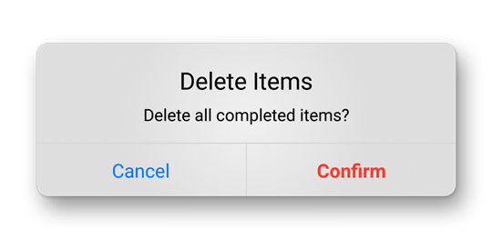
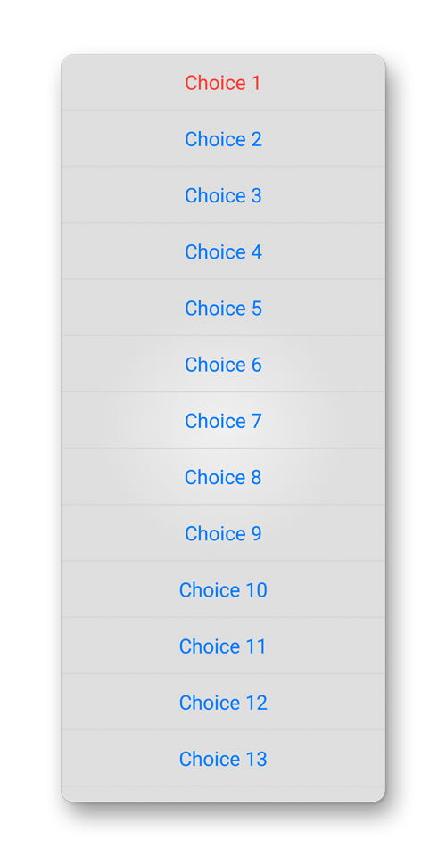
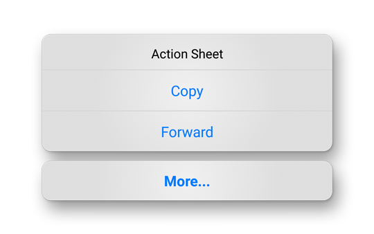
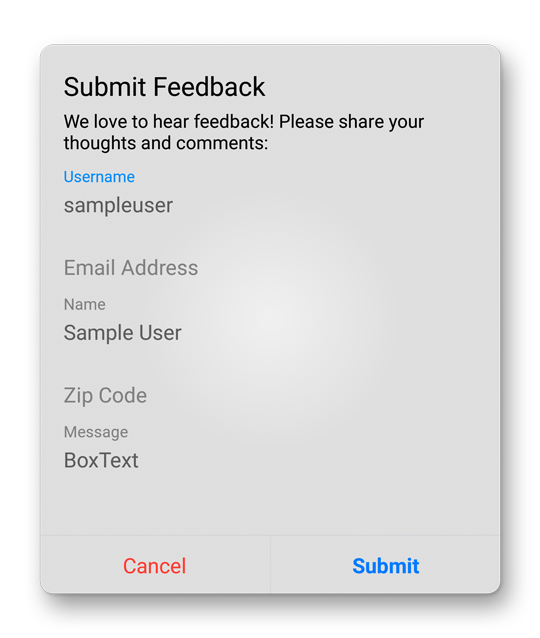

[](https://github.com/searchy2/CustomAlertViewDialogue/releases) [](https://github.com/searchy2/CustomAlertViewDialogue) [](https://github.com/searchy2/CustomAlertViewDialogue) [](https://github.com/searchy2/CustomAlertViewDialogue) [](https://github.com/searchy2/CustomAlertViewDialogue) [](https://github.com/searchy2/CustomAlertViewDialogue) [](https://github.com/searchy2/CustomAlertViewDialogue)
# Custom AlertView Dialogue


Custom AlertView Dialogue is the world's most advanced alert view library. Custom AlertView Dialogue includes simple message popups, confirmation alerts, selector popups, action sheet bottom menus, and input/feedback contact forms. This library fixes many issues and crashes that plague other alert dialogue libraries and looks amazing while doing so! 


Custom AlertView Dialogue is part of the Custom UI collection of beautiful, minimalistic, and customizable Android UI components.

# Gradle Dependency

Add this line to your `build.gradle` project. Use the latest release version for the version code. 

```java
repositories {
    maven { url 'https://jitpack.io' }
}
implementation 'com.github.searchy2:CustomAlertViewDialogue:latest-version'
```
# Usage

### Code

Custom AlertView Dialogue uses the Builder format to initialize an alert view programmatically. To display an simple alert message, just drag and drop the following code into your project. It's that easy!


```java
CustomAlertDialogue.Builder alert = new CustomAlertDialogue.Builder(MainActivity.this)
        .setStyle(CustomAlertDialogue.Style.DIALOGUE)
        .setTitle("Custom Alert")
        .setMessage("This is a long description to test the dialogue's text wrapping functionality")
        .setNegativeText("OK")
        .setOnNegativeClicked(new CustomAlertDialogue.OnNegativeClicked() {
            @Override
            public void OnClick(View view, Dialog dialog) {
                dialog.dismiss();
            }
        })
        .build();
alert.show();
``` 
**IMPORTANT:** The Dialog Fragment is extremely picky about the `Activity` passed into the builder. If the improper Activity is passed, the dialogue will crash! Here's how to pass the proper Activity in the following cases:
* Activity - construct with `ClassName.this`
* Fragment - construct with `getActivity()`
* ViewHolder - construct with `getActivity().getApplicationContext()`

Do not attempt to construct the dialogue with `getContext()`. The Builder requires an Activity and passing a Context does not work! 

# Customization

Custom AlertView Dialogue provides many customization methods to display the alerts you need.

### Layouts

**Simple Alert - a simple popup message.**


```java
CustomAlertDialogue.Builder alert = new CustomAlertDialogue.Builder(MainActivity.this)
        .setStyle(CustomAlertDialogue.Style.DIALOGUE)
        .setTitle("Custom Alert")
        .setMessage("This is a long description to test the dialogue's text wrapping functionality")
        .setNegativeText("OK")
        .setNegativeColor(R.color.negative)
        .setNegativeTypeface(Typeface.DEFAULT_BOLD)
        .setOnNegativeClicked(new CustomAlertDialogue.OnNegativeClicked() {
            @Override
            public void OnClick(View view, Dialog dialog) {
                dialog.dismiss();
            }
        })
        .build();
alert.show();

```

**Confirmation Alert - a popup dialogue with two customizable choices.**



```java
CustomAlertDialogue.Builder alert = new CustomAlertDialogue.Builder(MainActivity.this)
        .setStyle(CustomAlertDialogue.Style.DIALOGUE)
        .setCancelable(false)
        .setTitle("Delete Items")
        .setMessage("Delete all completed items?")
        .setPositiveText("Confirm")
        .setPositiveColor(R.color.negative)
        .setPositiveTypeface(Typeface.DEFAULT_BOLD)
        .setOnPositiveClicked(new CustomAlertDialogue.OnPositiveClicked() {
            @Override
            public void OnClick(View view, Dialog dialog) {
                dialog.dismiss();
                Toast.makeText(mContext, "Items Deleted", Toast.LENGTH_SHORT).show();
            }
        })
        .setNegativeText("Cancel")
        .setNegativeColor(R.color.positive)
        .setOnNegativeClicked(new CustomAlertDialogue.OnNegativeClicked() {
            @Override
            public void OnClick(View view, Dialog dialog) {
                dialog.dismiss();
            }
        })
        .build();
alert.show();
```

**Selector - a scrollable list of options.**



```java
ArrayList<String> destructive = new ArrayList<>();
destructive.add("Choice 1");

ArrayList<String> other = new ArrayList<>();
other.add("Choice 2");
other.add("Choice 3");
other.add("Choice 4");
other.add("Choice 5");
other.add("Choice 6");
other.add("Choice 7");
other.add("Choice 8");
other.add("Choice 9");
other.add("Choice 10");
other.add("Choice 11");
other.add("Choice 12");
other.add("Choice 13");
other.add("Choice 14");
other.add("Choice 15");
other.add("Choice 16");
other.add("Choice 17");
other.add("Choice 18");
other.add("Choice 19");
other.add("Choice 20");

CustomAlertDialogue.Builder alert = new CustomAlertDialogue.Builder(MainActivity.this)
        .setStyle(CustomAlertDialogue.Style.SELECTOR)
        .setDestructive(destructive)
        .setOthers(other)
        .setOnItemClickListener(new AdapterView.OnItemClickListener() {
            @Override
            public void onItemClick(AdapterView<?> adapterView, View view, int i, long l) {
                CustomAlertDialogue.getInstance().dismiss();
                Toast.makeText(mContext, "Selected " + i, Toast.LENGTH_SHORT).show();
            }
        })
        .build();
alert.show();
```

**Action Sheet - a highly customizable bottom menu.**



```java
ArrayList<String> other = new ArrayList<String>();
other.add("Copy");
other.add("Forward");

CustomAlertDialogue.Builder alert = new CustomAlertDialogue.Builder(MainActivity.this)
        .setStyle(CustomAlertDialogue.Style.ACTIONSHEET)
        .setTitle("Action Sheet")
        .setTitleColor(R.color.text_default)
        .setCancelText("More...")
        .setOnCancelClicked(new CustomAlertDialogue.OnCancelClicked() {
            @Override
            public void OnClick(View view, Dialog dialog) {
                Vibrator vibe = (Vibrator) mContext.getSystemService(Context.VIBRATOR_SERVICE);
                vibe.vibrate(10);
                dialog.dismiss();
                Handler handler = new Handler();
                Runnable r = new Runnable() {
                    public void run() {
                        MoreSelector();
                    }
                };
                handler.postDelayed(r, 50);
            }
        })
        .setOthers(other)
        .setOnItemClickListener(new AdapterView.OnItemClickListener() {
            @Override
            public void onItemClick(AdapterView<?> adapterView, View view, int i, long l) {
                String selection = adapterView.getItemAtPosition(i).toString();
                Vibrator vibe = (Vibrator) mContext.getSystemService(Context.VIBRATOR_SERVICE);
                vibe.vibrate(10);
                switch (selection)
                {
                    case "Copy":
                        CustomAlertDialogue.getInstance().dismiss();
                        Toast.makeText(mContext, "Copied", Toast.LENGTH_SHORT).show();
                        break;
                    case "Forward":
                        CustomAlertDialogue.getInstance().dismiss();
                        Toast.makeText(mContext, "Forwarded", Toast.LENGTH_SHORT).show();
                        break;
                }
            }
        })
        .build();
alert.show();
```

**Input Box - helps collect user input. Can be used as a contact/feedback form.**



```java
ArrayList<String> lineHint = new ArrayList<>();
lineHint.add("Username");
lineHint.add("Email Address");
lineHint.add("Name");
lineHint.add("Zip Code");

ArrayList<String> lineText = new ArrayList<>();
lineText.add("sampleuser");
lineText.add(null);
lineText.add("Sample User");

ArrayList<String> boxHint = new ArrayList<>();
boxHint.add("Message");

ArrayList<String> boxText = new ArrayList<>();
boxText.add("BoxText");

CustomAlertDialogue.Builder alert = new CustomAlertDialogue.Builder(MainActivity.this)
        .setStyle(CustomAlertDialogue.Style.INPUT)
        .setTitle("Submit Feedback")
        .setMessage("We love to hear feedback! Please share your thoughts and comments:")
        .setPositiveText("Submit")
        .setPositiveColor(R.color.positive)
        .setPositiveTypeface(Typeface.DEFAULT_BOLD)
        .setOnInputClicked(new CustomAlertDialogue.OnInputClicked() {
            @Override
            public void OnClick(View view, Dialog dialog, ArrayList<String> inputList) {
                Toast.makeText(mContext, "Sent", Toast.LENGTH_SHORT).show();
                for (String input : inputList)
                {
                    Log.d("Input", input);
                }
                dialog.dismiss();
            }
        })
        .setNegativeText("Cancel")
        .setNegativeColor(R.color.negative)
        .setOnNegativeClicked(new CustomAlertDialogue.OnNegativeClicked() {
            @Override
            public void OnClick(View view, Dialog dialog) {
                dialog.dismiss();
            }
        })
        .setLineInputHint(lineHint)
        .setLineInputText(lineText)
        .setBoxInputHint(boxHint)
        .setBoxInputText(boxText)
        .build();
alert.show();
```

### Builder Attributes

`setStyle(Style style)` - set DIALOGUE, ACTIONSHEET, SELECTOR, INPUT to select AlertView type.

`setTitle(String title)` - set AlertView title text.

`setMessage(String message)` - set AlertView message text.

`setPositiveText(String positiveButtonText)` - set Confirmation Alert right button text.

`setNegativeText(String negativeText)` - set Simple Alert button text. Set Confirmation Alert left button text.

`setCancelText(String cancel)` - set Action Sheet cancel button text.

`setTitleColor(int titleColor)` - set title text color.

`setMessageColor(int messageColor)` - set message text color.

`setPositiveColor(int positiveTextColor)` - set positive button text color.

`setNegativeColor(int negativeColor)` - set negative button text color.

`setCancelColor(int cancelColor)` - set cancel button text color.

`setTitleFont(String titleFontPath)` - set title text font. Must pass the path to the font in the assets folder.

`setMessageFont(String bodyFontPath)` - set message text font. Must pass the path to the font in the assets folder.

`setPositiveTypeface(Typeface positiveTypeface)` - set positive button text typeface.

`setNegativeTypeface(Typeface negativeTypeface)` - set negative button text typeface.

`setOnPositiveClicked(OnPositiveClicked onPositiveClicked)` - pass a listener to be called when the positive button is clicked.

`setOnNegativeClicked(OnNegativeClicked onNegativeClicked)` - pass a listener to be called when the negative button is clicked.

`setOnCancelClicked(OnCancelClicked onCancelClicked)` - pass a listener to be called when the cancel button is clicked.

`setOnItemClickListener(AdapterView.OnItemClickListener onItemClickListener)` - pass a listener to be called when a selection item is clicked.

`setOnInputClicked(OnInputClicked onInputClicked)` - pass a listener to be called when an input box is submitted.

`setDestructive(ArrayList<String> destructive)` - converts a String ArrayList into destructive options in the selector.

`setOthers(ArrayList<String> others)` - converts a String ArrayList into neutral options in the selector.

`setLineInputText(ArrayList<String> lineInputText)` - converts a String ArrayList into single line text input boxes.

`setLineInputHint(ArrayList<String> lineInputHint)` - converts a String ArrayList into single line input boxes hints. Array length must match LineInputText length.

`setBoxInputText(ArrayList<String> boxInputText)` - converts a String ArrayList into multiline text input boxes.

`setBoxInputHint(ArrayList<String> boxInputHint)` - converts a String ArrayList into multiline input boxes hints. Array length must match BoxInputText length.

`setAutoHide(boolean autoHide)` - set `true` to automatically hide alert after a set time.

`setTimeToHide(int timeToHide)` - set time in milliseconds for popup to automatically dismiss. No listeners are triggered when dismissed automatically.

`setCancelable(boolean cancelable)` - set false to prevent dialogue dismissal through tapping outside or pressing the back button. Force the user to choose an option.

`build()` - Construct the Dialogue Builder.

`show()` - Display the Dialogue with Builder parameters.

View the Layouts section or the sample app for examples of how to use these Builder attributes. 

### Creating a New Layout

Custom AlertView Dialogue provides a powerful framework to creating new alert layouts quickly. If one of the existing alerts do not meet your needs, creating a new alert is very simple! You can take advantage of the existing dialogue code and just declare a new style in the Style enumerator. 

Once you have a new style, you can duplicate an existing layout or start from scratch. Dialog Fragment behaves much like a regular fragment with support for RecyclerViews and Relative Layouts. Most existing layout and code can be dragged and dropped into a Dialog Fragment. **Note:** Dialog Fragment does not support ViewPagers (once suffered a day's worth of work lost due to this unfortunate limitation :P).

With your new layout, all that is left is adding the corresponding code and listener callbacks. Most code works well within a Dialog Fragment just like layouts do. If you wish to pass back information, follow the existing examples to create your own onClickListener callback. 

Create the necessary Builder methods to customize your new layout and you're done! 

# Features Wishlist

These features would make this library even more awesome. You can contribute to this library by developing any of the features below. Or, if you really want to see a feature developed, you can sponsor me to develop the feature.

---

>Dynamic Blur Background

Create a dynamic blur to use as the dialogue's background. Currently, this library uses a transparent gradient as the dialogue's background. 

An attempt to create a dynamic blur was made with the CustomPermissionsDialogue library. Unfortunately, the blur library used does not position the blurred background correctly. This issue is detailed at https://github.com/Dimezis/BlurView/issues/63

If you know how to work with the BlurView library, your help would be greatly appreciated! 

>Date Selector

There are a lot of ugly date selectors. Then their are a lot of beautiful date selectors that don't calculate dates correctly or require a time to be selected as well. A beautiful, dedicated date selector with correct date calculation would be wonderful!

>Slider Value Picker

The easiest way to choose a number is with a slider. Having a slider integrated into this library would help cover many number entry scenarios. 

>Number Setter

This is a more precise way to select small numbers or numbers that do not change much. The number setter would have a text box in the middle that accepts direct number input and buttons on either side to increment or decrease the number. 

---

Pull requests are most welcome!

If you've fixed a bug or have a feature you've added, just create a pull request. If you've found a bug, file an issue. If you have any questions or would like to discuss upcoming features, please get in touch. You can get in touch with me in the Contact section below. 

# ★ Acknowledgements ★
**♥ Developer ♥**

Ray Li

**♥ Designer ♥**

Ray Li

**♥ Inspiration ♥**

UI design and functionality - https://github.com/saiwu-bigkoo/Android-AlertView

Dialog Fragment code - https://github.com/geniusforapp/fancyDialog

# ★ Get in Touch ★
<a href="mailto:ray.li.verified@gmail.com">
  
</a>
<a href="https://rayliverified.com">
  
</a>
<a href="https://twitter.com/RayLiVerified">
  
</a>
<a href="https://linkedin.com/in/rayliverified/">
  
</a>
<a href="https://www.uplabs.com/ray">
  
</a>
<a href="https://github.com/searchy2">
  
</a>

#### Search Terms
android, alert, alertview, popup, dialog, dialogs, select, selector, confirmation, bottom menu, action sheet, chooser, choice, options, display, input, box, message, contact, feedback, form, modal 
